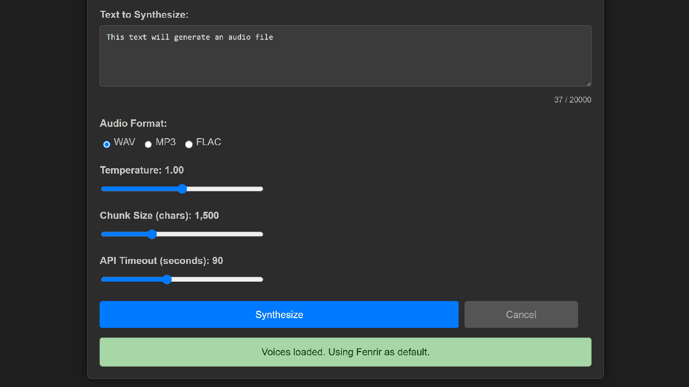

# Gemini TTS Server (Beta)

⚠️ **Warning**: This project is currently in beta testing phase. APIs may change without notice.

# Gemini TTS Server


[](https://github.com/psf/black)

A FastAPI server for Google Gemini Text-to-Speech with a modern web interface.

---

## Features

- Text-to-speech conversion using Google Gemini API
- Web-based interface for text input and voice selection
- Adjustable synthesis parameters (temperature, chunk size, timeout)
- Support for multiple audio formats (WAV, MP3, FLAC)
- Real-time task cancellation
- Modern, responsive UI
- Configuration via `config.toml` file

---

## Demo

<!-- Replace with your own screenshot or GIF -->


---

## System Requirements

- Tested with Python 3.10, 3.11, and 3.12 - Note: Python 3.13+ is not supported due to audioop deprecation
- 4GB RAM minimum
- 100MB disk space
- Google Gemini API Key
- Stable internet connection

---

## Installation Guide

### 1. Clone the Repository
```bash
git clone https://github.com/yourusername/google-tts-server.git
cd google-tts-server
```

### 2. Set Up Virtual Environment (Recommended)
```bash
# Windows:
python -m venv venv
venv\Scripts\activate

# Mac/Linux:
python3 -m venv venv
source venv/bin/activate
```

### 3. Install Dependencies
```bash
pip install -r requirements.txt
```

### 4. Configuration Setup

#### Environment Variables
Create `.env` file:
```bash
cp .env.example .env  # If example exists
# Or create manually:
echo "GEMINI_API_KEY=your_api_key_here" > .env
```

#### Server Configuration
Edit `config.toml`:
```toml
[server]
host = "127.0.0.1"  # Change to "0.0.0.0" for network access
port = 8008         # Use any available port

[tts]
default_model = "gemini-2.5-pro-preview-tts"
default_voice = "Fenrir"
default_format = "wav"
```

### 5. Verify Installation
```bash
python -c "import uvicorn, fastapi; print('Dependencies OK')"
```

### 6. Start the Server

```bash
# Windows:
py server.py

# Mac/Linux:
python3 server.py
```

### 7. Access the Web Interface
Open in your browser:
[http://localhost:8008](http://localhost:8008)

> 💡 **Tip**: Use `--reload` flag during development:
> `python server.py --reload`

---

## Usage

- Enter your text, select a voice and parameters, and click **Synthesize**.
- Download or play the generated audio directly from the web interface.
- Cancel long-running tasks in real time.

---

## API Reference

### Authentication
No authentication required for local development. For production, consider adding API key authentication.

### Endpoints

#### `POST /api/synthesize`
Convert text to speech audio.

**Request:**
```json
{
  "task_id": "required-uuid",
  "text": "Hello world",
  "voice_name": "Fenrir",
  "audio_format": "mp3",
  "temperature": 1.0,
  "chunk_size_chars": 1500,
  "style_prompt": "optional style text",
  "api_timeout_seconds": 60
}
```

**Success Response:**
- Status: 200 OK
- Headers: `Content-Type: audio/mp3`
- Body: Binary audio data

**Success Response:**
- Status: 200 OK
- Headers: `Content-Type: audio/mp3`
- Body: Binary audio data

---

#### `GET /api/voices`
List available voices.

**Example Request:**
```bash
curl http://localhost:8008/api/voices
```

**Response:**
```json
{
  "voices": [
    {
      "display_name": "Fenrir",
      "description": "Male • Excitable",
      "api_name": "Fenrir"
    }
  ],
  "default_voice": "Fenrir"
}
```

---

#### `POST /api/cancel_task/{task_id}`
Cancel a running synthesis task.

**Example Request:**
```bash
curl -X POST http://localhost:8008/api/cancel_task/test-task-123
```

**Response:**
```json
{
  "message": "Cancellation request processed",
  "task_id": "your-task-id"
}
```

---

---

## Troubleshooting Guide

### Common Issues

#### No Audio Output
1. Verify API key in `.env` is valid
2. Check server logs for errors
3. Test with complete request: `curl -X POST http://localhost:8008/api/synthesize -H "Content-Type: application/json" -d '{"task_id":"test-123", "text":"test", "voice_name":"Fenrir", "audio_format":"mp3", "chunk_size_chars":1500}'`


#### API Error Codes
| Code | Meaning | Solution |
|------|---------|----------|
| 400 | Invalid input parameters | Check request format |
| 403 | Invalid API key | Check `.env` file |
| 404 | No voices found | Check API connection |
| 429 | Rate limit exceeded | Wait or increase limits |
| 499 | Task cancelled | N/A |
| 500 | Server error | Check logs |

---

## Project Structure

```
.
├── app/                 # Application code
│   ├── main.py          # FastAPI routes
│   ├── tts_client.py    # Gemini API client
│   ├── task_registry.py # Task management
│   ├── static/          # Web assets
│   │   ├── css/
│   │   ├── js/
│   │   └── index.html
├── config.toml          # Configuration
├── requirements.txt     # Dependencies
├── server.py            # Entry point
└── README.md            # Documentation
```

---

## Contributing

1. Fork the repository
2. Create feature branch (`git checkout -b feature/your-feature`)
3. Commit changes (`git commit -am 'Add some feature'`)
4. Push to branch (`git push origin feature/your-feature`)
5. Open Pull Request

---

## License
MIT License - See [LICENSE](LICENSE) for details.

---

## Acknowledgments
- [FastAPI](https://fastapi.tiangolo.com/) - Web framework
- [pydub](https://github.com/jiaaro/pydub) - Audio processing
- [Google Gemini](https://ai.google.dev/) - TTS API
